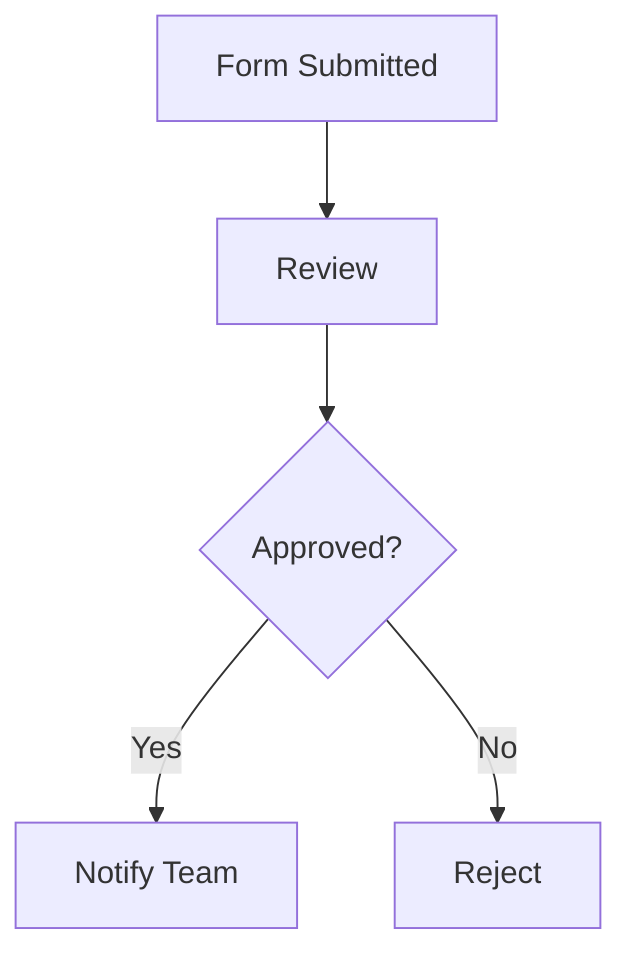

## Overview

D.Galkin provides powerful digital interaction tools that streamline your daily tasks. You can manage documents, automate workflows, and collaborate seamlessly with teams. This guide covers the core features, from basic interactions to advanced customization and analytics.

<Callout kind="info">
  Start with the free tier to test core features before upgrading for advanced analytics and unlimited collaborations.
</Callout>

## Primary Digital Interaction Tools

D.Galkin offers intuitive tools for everyday digital tasks. Use the drag-and-drop interface to build forms, edit content in real-time, and integrate with external services.

<Columns cols={3}>
  <Card title="Form Builder" icon="edit-3" href="#form-builder">
    Create custom forms without coding.
  </Card>
  <Card title="Real-Time Editor" icon="file-text" href="#editor">
    Collaborate on documents instantly.
  </Card>
  <Card title="Automation Flows" icon="zap" href="#automation">
    Set up triggers for repetitive tasks.
  </Card>
</Columns>

## Customization Options

Tailor D.Galkin to your needs with flexible customization. Switch between visual editors and code-based tweaks.

<Tabs>
  <Tab title="Visual Customizer" icon="palette">
    Access the dashboard at `https://dashboard.example.com/customize`.

    1. Select your workspace.
    2. Choose themes from the library.
    3. Apply changes live.

    <Image
      src="https://via.placeholder.com/800x400/3B82F6/white?text=Visual+Customizer"
      alt="D.Galkin visual customizer interface"
      width="800"
      height="400"
    />
  </Tab>
  <Tab title="API Customization" icon="code">
    Use the API for programmatic changes.

````jsx
<CodeGroup tabs="JavaScript,Python">
```javascript
const response = await fetch('https://api.example.com/v1/customize', {
  method: 'POST',
  headers: { 'Authorization': `Bearer ${YOUR_API_KEY}` },
  body: JSON.stringify({ theme: 'dark', font: 'inter' })
});
```
```python
import requests
response = requests.post(
  'https://api.example.com/v1/customize',
  headers={'Authorization': f'Bearer {YOUR_API_KEY}'},
  json={'theme': 'dark', 'font': 'inter'}
)
```
</CodeGroup>
````
  </Tab>
</Tabs>

## Collaboration and Sharing Features

Share your D.Galkin projects effortlessly. Invite team members, set permissions, and track changes.

<Steps>
  <Step title="Invite Collaborators" icon="users">
    Navigate to project settings and add emails.

````bash
curl -X POST https://api.example.com/v1/projects/{projectId}/collaborators \
  -H "Authorization: Bearer YOUR_API_KEY" \
  -d '{"emails": ["user@example.com", "team@company.com"]}'
````
  </Step>
  <Step title="Set Permissions" icon="shield">
    Choose roles: viewer, editor, or admin.
  </Step>
  <Step title="Share Public Link" icon="link">
    Generate a secure link for external access.
  </Step>
</Steps>

<ParamField path="projectId" param-type="string" required="true">
  Unique project identifier from the dashboard.
</ParamField>

## Analytics and Reporting Basics

Track usage with built-in analytics. View reports on interactions, completion rates, and more.

```javascript
// Fetch analytics data
const analytics = await fetch('https://api.example.com/v1/analytics?period=30d', {
  headers: { 'Authorization': `Bearer ${YOUR_API_KEY}` }
}).then(res => res.json());

console.log(analytics.views); // e.g., 1500
```

| Metric          | Description                  | Example Value |
|-----------------|------------------------------|---------------|
| Total Views     | Page loads and interactions  | `>1000`       |
| Completion Rate | Form submissions completed   | `85%`         |
| Active Users    | Unique users in last 30 days | `50`          |

<ResponseField name="views" field-type="number">
  Total number of views.
</ResponseField>

<ResponseField name="completionRate" field-type="number">
  Percentage of completed interactions.
</ResponseField>

## Real-World Use Cases

Apply D.Galkin to various scenarios.

<ExpandableGroup>
  <Expandable title="Task Automation for Teams" default-open="true">
    Automate approval workflows.


  </Expandable>
  <Expandable title="Customer Feedback Collection">
    Build surveys and analyze responses in real-time.
  </Expandable>
</ExpandableGroup>

<Callout kind="tip">
  Integrate with `https://api.example.com/webhooks` for custom notifications. See the [quickstart](/quickstart) for setup.
</Callout>